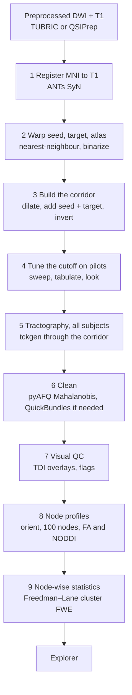

# Workflow at a glance

Nine steps, one tract at a time. Steps 1 and 2 are per subject and reused across tracts; steps 3 to 9 repeat per tract by re-sourcing the config with a different seed, target and atlas.



## Inputs you need per subject

| Input | From | Path in the scripts |
|---|---|---|
| Skull-stripped T1 | preprocessing | `$PROJECT/anat/<subj>/<subj>_T1w_brain.nii.gz` |
| Normalized white-matter FOD (`.mif`) | MRtrix MSMT-CSD + `mtnormalise` | `$PROJECT/dwi/<subj>/wm_fod_norm.mif` |
| Diffusion brain mask | preprocessing | `$PROJECT/dwi/<subj>/nodif_brain_mask.nii.gz` |
| T1 → diffusion matrix (only if the grids differ) | FLIRT | `$PROJECT/xfm/<subj>/str2diff.mat` |
| Scalar maps to profile | DTIFIT, AMICO NODDI | `$PROJECT/dwi/<subj>/fa.nii.gz`, `$PROJECT/noddi/<subj>/fit_*.nii.gz` |

If your T1 is already on the diffusion grid (HCP-style data), leave the matrix out and the warp script resamples directly.

## What the scripts write

```
$OUT/<subj>/
  reg/          mni2t1_0GenericAffine.mat, mni2t1_1Warp.nii.gz, mni2t1_1InverseWarp.nii.gz
  rois/         <tract>_{seed,target,atlas}_{t1,diff}.nii.gz
                <tract>_atlas_dilated.nii.gz  <tract>_inclusion_zone.nii.gz  <tract>_exclusion_mask.nii.gz
  tckgen/<tract>/
                <tract>_pilot_<cutoff>.tck (step 4)
                <tract>_<cutoff>.tck  <tract>_<cutoff>_cleaned.tck
$OUT/qc/<tract>/               per-subject overlay PNGs + flags
$OUT/qc/<tract>_cutoff_pilot/  side-by-side cutoff panels, cutoff_summary.csv
$OUT/nodewise/                 <tract>_nodewise_all_subjects.csv (Subject, Tract, Node, FA, NDI, ODI, FWF)
```

Keep a manifest per analysis: atlas version and threshold, dilation, interpolation, transform files, cutoff, scalar maps, covariates, software versions.

## Running the scripts

Every script sources `00_config.sh`. Edit that file once for your project, and re-source it with a different `TRACT`, `SEED_MNI`, `TARGET_MNI`, `ATLAS_MNI` for each tract.

```bash
cd scripts
nano 00_config.sh          # set PROJECT, SUBJECTS_FILE, ATLAS_DIR, the tract, the parameters
bash 01_register_mni_to_t1.sh
bash 02_warp_rois.sh
bash 03_build_corridor_mask.sh
bash 04_tune_cutoff.sh "s001 s002 s003 s004 s005" "0.1 0.08 0.06 0.01"
python 04b_compare_cutoffs.py "s001 s002 s003 s004 s005" "0.1 0.08 0.06 0.01"
bash 05_tractography.sh
python 06_clean_bundles.py
python 07_visual_qc.py
python 08_node_profiles.py
```

Long steps (1, 5) belong in `tmux` or a scheduler. The example dataset used a shared 48-core node; the parallelism limits in the scripts are set for that and should be lowered on a laptop.
