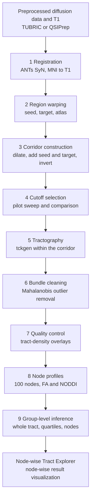

# Workflow overview

The workflow comprises nine steps applied to one tract at a time (Figure 1). Steps 1 and 2 are performed once per participant and reused across tracts. Steps 3 through 9 are repeated for each tract by changing the seed, target and atlas file in the configuration.



*Figure 1.* Sequence of the corridor workflow. The final stage is the Node-wise Tract Explorer, the browser-based results viewer described in the Explorer section.

## Inputs

**Table 1.** *Per-participant inputs.*

| Input | Origin | Path used by the scripts |
|---|---|---|
| Skull-stripped T1-weighted image | preprocessing | `$PROJECT/anat/<subj>/<subj>_T1w_brain.nii.gz` |
| Normalized white-matter fibre orientation distribution (FOD; `.mif`) | MRtrix MSMT-CSD and `mtnormalise` | `$PROJECT/dwi/<subj>/wm_fod_norm.mif` |
| Diffusion-space brain mask | preprocessing | `$PROJECT/dwi/<subj>/nodif_brain_mask.nii.gz` |
| T1 → diffusion affine matrix (if the grids differ) | FLIRT | `$PROJECT/xfm/<subj>/str2diff.mat` |
| Scalar maps for profiling | DTIFIT; AMICO NODDI | `$PROJECT/dwi/<subj>/fa.nii.gz`; `$PROJECT/noddi/<subj>/fit_*.nii.gz` |

When the T1 image is already aligned to the diffusion grid, as in HCP data, the affine matrix is omitted and the warp script resamples directly.

## Outputs

```
$OUT/<subj>/
  reg/          mni2t1_0GenericAffine.mat, mni2t1_1Warp.nii.gz, mni2t1_1InverseWarp.nii.gz
  rois/         <tract>_{seed,target,atlas}_{t1,diff}.nii.gz
                <tract>_atlas_dilated.nii.gz  <tract>_inclusion_zone.nii.gz  <tract>_exclusion_mask.nii.gz
  tckgen/<tract>/
                <tract>_pilot_<cutoff>.tck          (step 4)
                <tract>_<cutoff>.tck  <tract>_<cutoff>_cleaned.tck
$OUT/qc/<tract>/               per-participant overlay images and flags
$OUT/qc/<tract>_cutoff_pilot/  cutoff comparison panels, cutoff_summary.csv
$OUT/nodewise/                 <tract>_nodewise_all_subjects.csv  (Subject, Tract, Node, FA, NDI, ODI, FWF)
```

A manifest should be kept for each analysis recording the atlas version and threshold, dilation, interpolation, transform files, cutoff, scalar maps, covariates and software versions.

## Scripts

All scripts read a single configuration file, `00_config.sh`, which specifies project paths, the participant list, the tract definition and the tractography parameters. The configuration is edited once per project; the tract fields (`TRACT`, `SEED_MNI`, `TARGET_MNI`, `ATLAS_MNI`) are changed for each tract.

```bash
cd scripts
nano 00_config.sh
bash 01_register_mni_to_t1.sh
bash 02_warp_rois.sh
bash 03_build_corridor_mask.sh
bash 04_tune_cutoff.sh "s001 s002 s003 s004 s005" "0.1 0.08 0.06 0.01"
python 04b_compare_cutoffs.py "s001 s002 s003 s004 s005" "0.1 0.08 0.06 0.01"
bash 05_tractography.sh
python 06_clean_bundles.py
python 07_visual_qc.py
python 08_node_profiles.py
```

Steps 1 and 5 require hours on a full sample and should be run under `tmux` or a job scheduler. The concurrency limits in the scripts were set for a shared 48-core node and should be reduced on a workstation.
