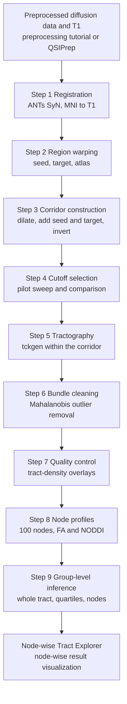

# Workflow overview

The workflow comprises nine steps applied to one tract at a time (Figure 1). Step 1 is performed once per participant and reused across tracts. Steps 2 through 9 are repeated for each tract by changing the tract name and the seed, target and atlas files in the configuration.

**Figure 1**

*Sequence of the Corridor Workflow*



*Note.* MNI = Montreal Neurological Institute; FA = fractional anisotropy; NODDI = neurite orientation dispersion and density imaging. The Node-wise Tract Explorer is the browser-based results viewer described in the Explorer section.

## Inputs

Table 1 lists the per-participant inputs. When the T1 image is already aligned to the diffusion image, as in Human Connectome Project data, no affine matrix is needed: `T1_TO_DWI` is set to `header` in the configuration and the warp script resamples by image header. With the default, `matrix`, a participant without a matrix is reported as missing an input.

**Table 1**

*Per-Participant Inputs*

| Input | Origin | Path used by the scripts |
|---|---|---|
| Skull-stripped T1-weighted image | preprocessing | `$PROJECT/anat/<subj>/<subj>_T1w_brain.nii.gz` |
| Normalized white-matter fibre orientation distribution (FOD; `.mif`) | MRtrix3 multi-shell multi-tissue CSD and `mtnormalise` | `$PROJECT/dwi/<subj>/wm_fod_norm.mif` |
| Diffusion-space brain mask | preprocessing | `$PROJECT/dwi/<subj>/nodif_brain_mask.nii.gz` |
| Preprocessed diffusion data with *b*-values and gradient directions (needed only to estimate FODs or fit NODDI) | preprocessing | `$PROJECT/dwi/<subj>/data.nii.gz`, `bvals`, `bvecs` |
| Mean *b* = 0 image (optional; background of the quality-control images) | preprocessing | `$PROJECT/dwi/<subj>/mean_b0.nii.gz` |
| T1 → diffusion affine matrix (when `T1_TO_DWI=matrix`) | FLIRT | `$PROJECT/xfm/<subj>/str2diff.mat` |
| Scalar maps for profiling | DTIFIT; AMICO NODDI | `$PROJECT/dwi/<subj>/fa.nii.gz`; `$PROJECT/noddi/<subj>/fit_*.nii.gz` |

*Note.* CSD = constrained spherical deconvolution.

## Outputs

```
$OUT/<subj>/
  reg/          mni2t1_0GenericAffine.mat, mni2t1_1Warp.nii.gz, mni2t1_1InverseWarp.nii.gz
  rois/         <tract>_{seed,target,atlas}_{t1,diff}.nii.gz
                <tract>_atlas_dilated.nii.gz  <tract>_inclusion_zone.nii.gz  <tract>_exclusion_mask.nii.gz
  tckgen/<tract>/
                <tract>_pilot_<cutoff>.tck          (Step 4)
                <tract>_<cutoff>.tck  <tract>_<cutoff>_cleaned.tck
$OUT/qc/<tract>_cutoff_pilot/  cutoff comparison panels, cutoff_summary.csv         (Step 4b)
$OUT/qc/<tract>_tckgen_summary.csv   streamlines selected and generated            (Step 5)
$OUT/qc/<tract>/               per-participant overlay images, qc_flags.csv        (Step 7)
$OUT/nodewise/                 <tract>_tract_stats.csv     cleaned-bundle Streamline_count,
                                                           Mean_length_mm          (Step 6)
                               <tract>_nodewise_all_subjects.csv
                                   Subject, Tract, Node, FA, NDI, ODI, FWF         (Step 8)
$OUT/analysis/                 <tract>__<metric>__analysis.csv   one row per participant (Step 8b)
                               <tract>__<metric>__tract_models.csv                 (Step 9a)
$OUT/permutation/              <tract>__<metric>__<outcome>_{nodewise,clusters,summary}.csv
                               results_long.csv            Explorer input     (Steps 9b, 9c)
$OUT/logs/                     one log per shell step script
```

A manifest should be kept for each analysis recording the atlas version and threshold, dilation, interpolation, transform files, cutoff, scalar maps, covariates and software versions.

## Scripts

All scripts read a single configuration file, `00_config.sh`, which specifies project paths, the participant list, the tract definition and the tractography parameters. The configuration is edited once per project; the tract fields (`TRACT`, `SEED_MNI`, `TARGET_MNI`, `ATLAS_MNI`) are changed for each tract. The shell scripts write a log to `$OUT/logs/`. Steps 0b, 1, 2, 3, 5, 6, 7 and 8a skip participants whose output already exists, so an interrupted run can be restarted with the same command; tractograms and FOD images are written under a temporary name and renamed on completion, so a file left by an interrupted run is never taken for a finished one. Setting `FORCE=1` recomputes existing outputs. Steps 4, 8, 8b and 9 recompute on every run. The Python and R scripts read the settings exported by `source 00_config.sh`; the file must be sourced again after every edit, otherwise those scripts continue to use the previous values. Steps 0b, 1 and 5 require hours on a full sample and should be run under `tmux` or a job scheduler. The concurrency settings in the configuration (`NTHREADS`, `MAXJOBS`, `ANTS_THREADS`, `ANTS_JOBS`, `FOD_JOBS`) were chosen for a 48-core node and should be reduced on a workstation or a shared machine.

```bash
cd scripts
nano 00_config.sh                 # project paths, tract definition, parameters
source 00_config.sh               # the Python and R scripts read these settings

bash 00b_fod_estimation.sh        # only if wm_fod_norm.mif does not yet exist
bash 01_register_mni_to_t1.sh
bash 02_warp_rois.sh
bash 03_build_corridor_mask.sh
bash 04_tune_cutoff.sh "sub-01 sub-02 sub-03 sub-04 sub-05" "0.1 0.08 0.06 0.01"
python 04b_compare_cutoffs.py "sub-01 sub-02 sub-03 sub-04 sub-05" "0.1 0.08 0.06 0.01"
bash 05_tractography.sh
python 06_clean_bundles.py
python 07_visual_qc.py
python 08a_noddi_fit.py           # omit to profile FA only; Step 8 drops metrics with no maps
python 08_node_profiles.py
python 08b_build_analysis_csv.py  # analysis files for Step 9

python 09a_tract_models.py --metric NDI --outcomes memory_accuracy
mkdir -p "$OUT/permutation"
Rscript 09b_nodewise_permutation.R "$OUT/analysis/${TRACT}__NDI__analysis.csv" \
    memory_accuracy NDI_ "$OUT/permutation" "${TRACT}__NDI__memory_accuracy"
python 09c_stack_for_explorer.py "$OUT/permutation"
```

The configuration file follows.

<!-- script:00_config.sh -->
<details>
<summary>Script <code>00_config.sh</code> (81 lines)</summary>

```bash title="00_config.sh"
#!/bin/bash
# =============================================================================
# Shared configuration for the MesoConnect corridor workflow; every step script sources it.
# Inputs:  $PROJECT/{anat,dwi,noddi,xfm}/<subj>/, subjects.txt, covariates.csv, $ATLAS_DIR
# Outputs: none of its own; every step writes under $OUT
# Run:     source 00_config.sh   (FSL set up first; re-source after every edit)
# =============================================================================

# --- project -----------------------------------------------------------------
export PROJECT="/path/to/project"
export SUBJECTS_FILE="$PROJECT/subjects.txt"     # one participant ID per line
export ATLAS_DIR="/path/to/MesoConnectAtlas"     # atlas and region files, MNI 1 mm
export OUT="$PROJECT/derivatives/mesoconnect"    # everything this workflow writes
export FORCE="${FORCE:-0}"                        # 1 = recompute existing outputs

# --- tract definition (one tract per run; change these four lines and rerun Steps 2-9) ---
export TRACT="l_vta_l_hipp"                      # name used for all outputs
export SEED_MNI="$ATLAS_DIR/roi_maps/left_VTA_0.25_bin.nii.gz"
export TARGET_MNI="$ATLAS_DIR/roi_maps/HPC_L_0.5_bin.nii.gz"
export ATLAS_MNI="$ATLAS_DIR/tracts_thresholded_binary_50/\
l_vta_l_hipp_1mm_MNI_GroupMean_thr50.nii.gz"

# --- T1 -> DWI transform (Step 2): "matrix" = xfm/<subj>/str2diff.mat, "header" = same grid
export T1_TO_DWI="matrix"

# --- corridor and tractography parameters (see Reference: Parameters) --------
export DILATE_VOX=2          # corridor dilation, voxels (1-2; 4 if registration is uncertain)
export CUTOFF=0.01           # FOD amplitude cutoff selected in Step 4 (MRtrix default 0.05)
export SELECT=2500           # streamlines to retain
export SEEDS=25000000        # maximum seeding attempts
export MINLEN=35             # minimum streamline length, mm
export MAXLEN=65             # maximum streamline length, mm

# --- group-level models (Steps 8b and 9) -------------------------------------
export COVARIATES_CSV="$PROJECT/covariates.csv"  # Subject, covariates, outcomes
# Columns of covariates.csv plus Mean_length_mm and Streamline_count (Step 6, cleaned bundle)
export COVARIATES="ICV,Mean_length_mm,Streamline_count,absolute_motion,age"
export N_PERMUTATIONS=5000

# --- software and concurrency (peak load is about jobs x threads; tuned for 48 cores) ---
export MNI_TEMPLATE="$FSLDIR/data/standard/MNI152_T1_1mm_brain.nii.gz"
export ANTSPATH="${ANTSPATH:-/usr/local/ants/bin}"
export PATH="$ANTSPATH:$PATH"
export NTHREADS=8            # threads per MRtrix command
export MAXJOBS=8             # participants processed concurrently in light steps (2, 3)
export ANTS_THREADS=4        # threads per registration (Step 1)
export ANTS_JOBS=4           # registrations run concurrently (Step 1)
export FOD_JOBS=2            # FOD estimations run concurrently (Step 0b; memory-intensive)

# --- helper functions used by the step scripts -------------------------------

start_log() {
  mkdir -p "$OUT/logs"
  exec > >(tee -a "$OUT/logs/$(basename "$1").log") 2>&1
  echo "== $(date '+%F %T')  $(basename "$1")  TRACT=$TRACT"
}

read_subjects() {
  SUBJECTS=($(tr -d '\r' < "$SUBJECTS_FILE"))
  echo "== ${#SUBJECTS[@]} participants in $SUBJECTS_FILE"
}

# Block until fewer than N background jobs are running (usage: throttle N)
throttle() {
  while [ "$(jobs -r | wc -l)" -ge "$1" ]; do
    sleep 1
  done
}

# A bare "wait" hangs on bash 5.0-5.2 (it also waits for the tee started by start_log).
wait_for_jobs() {
  throttle 1
}

nvox() {
  fslstats "$1" -V | awk '{print $1}'
}

present() {
  if [ -f "$1" ]; then echo ok; else echo MISSING; fi
}
```

</details>
<!-- /script:00_config.sh -->
