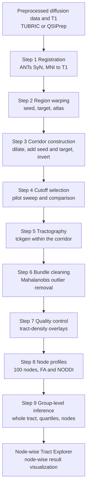

# Workflow overview

The workflow comprises nine steps applied to one tract at a time (Figure 1). Steps 1 and 2 are performed once per participant and reused across tracts. Steps 3 through 9 are repeated for each tract by changing the seed, target and atlas file in the configuration.

**Figure 1**

*Sequence of the Corridor Workflow*



*Note.* MNI = Montreal Neurological Institute; FA = fractional anisotropy; NODDI = neurite orientation dispersion and density imaging. The Node-wise Tract Explorer is the browser-based results viewer described in the Explorer section.

## Inputs

Table 1 lists the per-participant inputs. When the T1 image is already aligned to the diffusion grid, as in Human Connectome Project data, the affine matrix is omitted and the warp script resamples directly.

**Table 1**

*Per-Participant Inputs*

| Input | Origin | Path used by the scripts |
|---|---|---|
| Skull-stripped T1-weighted image | preprocessing | `$PROJECT/anat/<subj>/<subj>_T1w_brain.nii.gz` |
| Normalized white-matter fibre orientation distribution (FOD; `.mif`) | MRtrix3 multi-shell multi-tissue CSD and `mtnormalise` | `$PROJECT/dwi/<subj>/wm_fod_norm.mif` |
| Diffusion-space brain mask | preprocessing | `$PROJECT/dwi/<subj>/nodif_brain_mask.nii.gz` |
| T1 → diffusion affine matrix (if the grids differ) | FLIRT | `$PROJECT/xfm/<subj>/str2diff.mat` |
| Scalar maps for profiling | DTIFIT; AMICO NODDI | `$PROJECT/dwi/<subj>/fa.nii.gz`; `$PROJECT/noddi/<subj>/fit_*.nii.gz` |

*Note.* CSD = constrained spherical deconvolution.

## Outputs

```
$OUT/<subj>/
  reg/          mni2t1_0GenericAffine.mat, mni2t1_1Warp.nii.gz, mni2t1_1InverseWarp.nii.gz
  rois/         <tract>_{seed,target,atlas}_{t1,diff}.nii.gz
                <tract>_atlas_dilated.nii.gz  <tract>_inclusion_zone.nii.gz  <tract>_exclusion_mask.nii.gz
  tckgen/<tract>/
                <tract>_pilot_<cutoff>.tck          (Step 4)
                <tract>_<cutoff>.tck  <tract>_<cutoff>_cleaned.tck
$OUT/qc/<tract>/               per-participant overlay images and flags
$OUT/qc/<tract>_cutoff_pilot/  cutoff comparison panels, cutoff_summary.csv
$OUT/nodewise/                 <tract>_nodewise_all_subjects.csv  (Subject, Tract, Node, FA, NDI, ODI, FWF)
                               <tract>_tract_stats.csv            (Subject, Count_tckstats, Mean_tckstats; Step 5)
$OUT/analysis/                 <tract>__<metric>__analysis.csv    (wide; one row per participant; Step 8b)
$OUT/logs/                     one log per step script
```

A manifest should be kept for each analysis recording the atlas version and threshold, dilation, interpolation, transform files, cutoff, scalar maps, covariates and software versions.

## Scripts

All scripts read a single configuration file, `00_config.sh`, which specifies project paths, the participant list, the tract definition and the tractography parameters. The configuration is edited once per project; the tract fields (`TRACT`, `SEED_MNI`, `TARGET_MNI`, `ATLAS_MNI`) are changed for each tract. Every step script writes a log to `$OUT/logs/` and skips participants whose output already exists, so an interrupted run can be restarted with the same command; setting `FORCE=1` recomputes existing outputs. Steps 0b, 1 and 5 require hours on a full sample and should be run under `tmux` or a job scheduler. The concurrency limits in the scripts were set for a shared 48-core node and should be reduced on a workstation.

```bash
cd scripts
nano 00_config.sh
bash 00b_fod_estimation.sh        # only if wm_fod_norm.mif does not yet exist
bash 01_register_mni_to_t1.sh
bash 02_warp_rois.sh
bash 03_build_corridor_mask.sh
bash 04_tune_cutoff.sh "s001 s002 s003 s004 s005" "0.1 0.08 0.06 0.01"
python 04b_compare_cutoffs.py "s001 s002 s003 s004 s005" "0.1 0.08 0.06 0.01"
bash 05_tractography.sh
python 06_clean_bundles.py
python 07_visual_qc.py
python 08a_noddi_fit.py           # only if NODDI maps are wanted
python 08_node_profiles.py
python 08b_build_analysis_csv.py  # wide file for Step 9
```

The configuration file follows.

<!-- script:00_config.sh -->
```bash title="00_config.sh"
#!/bin/bash
# ============================================================
# MesoConnect corridor workflow — shared configuration
# ============================================================
# Source this file at the top of every step script:  source 00_config.sh
# Edit ONLY this file to point the workflow at the project.
# ------------------------------------------------------------
# Project root. Expected layout (per participant):
#   $PROJECT/anat/<subj>/<subj>_T1w_brain.nii.gz        skull-stripped T1
#   $PROJECT/dwi/<subj>/wm_fod_norm.mif                  normalized WM FOD (MRtrix)
#   $PROJECT/dwi/<subj>/nodif_brain_mask.nii.gz          diffusion-space brain mask
#   $PROJECT/dwi/<subj>/fa.nii.gz  (and NODDI maps)      scalar maps to profile
#   $PROJECT/xfm/<subj>/str2diff.mat                     FLIRT T1->diffusion (omit if T1 and DWI share a grid)
export PROJECT="/path/to/project"
export SUBJECTS_FILE="$PROJECT/subjects.txt"          # one subject ID per line
export ATLAS_DIR="/path/to/MesoConnectAtlas"           # downloaded atlas + ROI files (MNI 1mm)
export OUT="$PROJECT/derivatives/mesoconnect"          # everything this workflow writes
export COVARIATES_CSV="$PROJECT/covariates.csv"        # Subject + covariates + outcomes, one row per participant
# raw diffusion inputs, used only by 00b (FOD estimation) and 08a (NODDI fit)
export DWI_NII='$PROJECT/dwi/$s/data.nii.gz'; export BVALS='$PROJECT/dwi/$s/bvals'; export BVECS='$PROJECT/dwi/$s/bvecs'
export FORCE=0               # 1 = recompute outputs that already exist

# --- tract definition (one tract per run; re-source with different values for another tract) ---
export TRACT="l_vta_l_hipp"                                   # output name
export SEED_MNI="$ATLAS_DIR/roi_maps/left_VTA_0.25_bin.nii.gz"      # seed ROI, MNI 1mm, binary
export TARGET_MNI="$ATLAS_DIR/roi_maps/HPC_L_0.5_bin.nii.gz"        # target ROI, MNI 1mm, binary
export ATLAS_MNI="$ATLAS_DIR/tracts_thresholded_binary_50/l_vta_l_hipp_1mm_MNI_GroupMean_thr50.nii.gz"

# --- tractography parameters (see reference/parameters) ---
export DILATE_VOX=2          # corridor dilation in voxels (1-2 typical; 4 if registration is uncertain)
export CUTOFF=0.01           # FOD amplitude cutoff; 0.01 works with the corridor mask (MRtrix default 0.05)
export SELECT=2500           # streamlines to keep
export SEEDS=25000000        # max seeding attempts
export MINLEN=35             # mm
export MAXLEN=65             # mm
export NTHREADS=8

# --- software ---
export MNI_TEMPLATE="$FSLDIR/data/standard/MNI152_T1_1mm_brain.nii.gz"
export ANTSPATH="${ANTSPATH:-/usr/local/ants/bin}"; export PATH="$ANTSPATH:$PATH"
export MAXJOBS=8             # parallel subjects for lightweight steps

# --- logging: every step script calls this once after sourcing the config ---
start_log(){ mkdir -p "$OUT/logs"; exec > >(tee -a "$OUT/logs/$(basename "$1").log") 2>&1; echo "== $(date '+%F %T') $(basename "$1") TRACT=$TRACT =="; }
```
<!-- /script:00_config.sh -->
